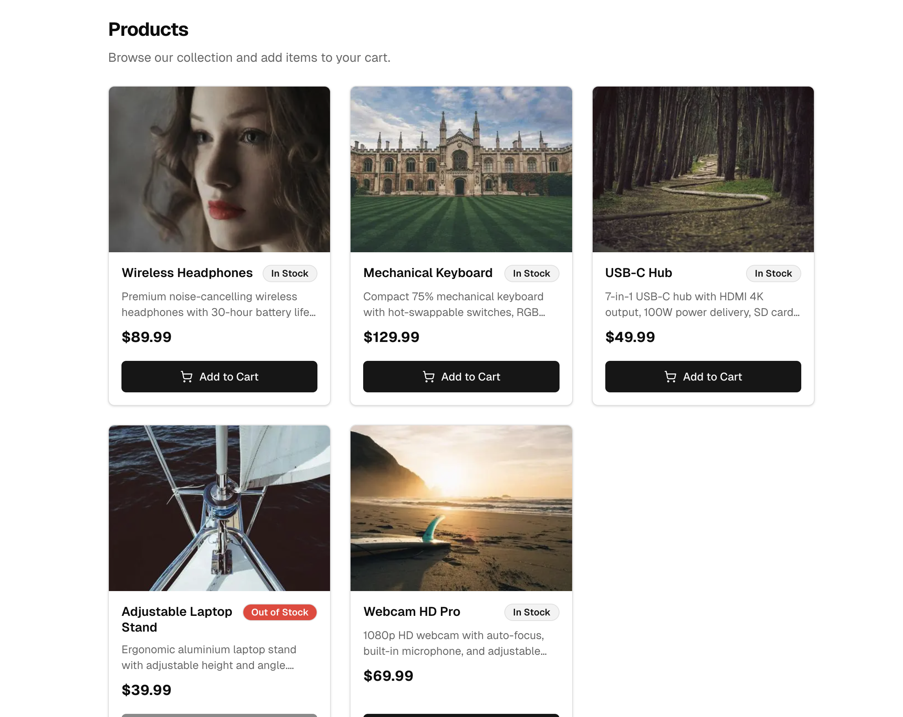
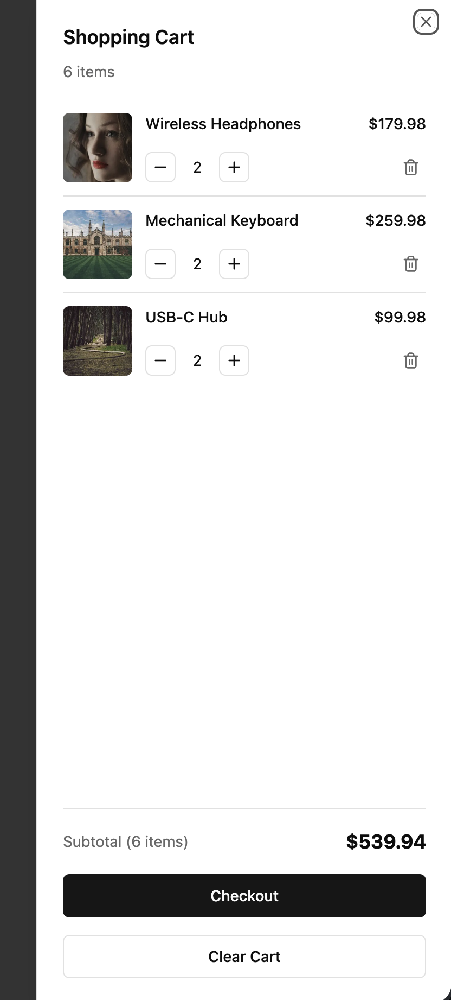

# Next Starter Kit

A Next.js 16 starter template demonstrating the **Domains + Features + Core** layered architecture. Built with React 19, Tailwind CSS v4, shadcn/ui, next-intl, Zustand, and Vitest. Includes a shopping cart demo with mock data—no backend required.

## Screenshots

### Product List

The Products page displays a responsive grid of product cards with images (via [Lorem Picsum](https://picsum.photos)), pricing, stock status, and Add to Cart actions.



### Shopping Cart

The slide-out cart panel shows cart items with quantity controls, line totals, subtotal, and checkout actions. Cart state is managed client-side with Zustand.



## Prerequisites

- **Node.js** >= 22.0.0
- **npm** >= 10.0.0

## Getting Started

```bash
# Install dependencies
npm install

# Start the development server
npm run dev
```

Open [http://localhost:3000](http://localhost:3000) in your browser. The app runs standalone with mock data—no API server needed.

## Scripts

| Command | Description |
|---------|-------------|
| `npm run dev` | Start development server |
| `npm run build` | Type-check, lint, test, then build for production |
| `npm run compile` | Build for production (skip checks) |
| `npm run start` | Start production server |
| `npm run lint` | Run ESLint |
| `npm run lint:fix` | Run ESLint with auto-fix |
| `npm run type-check` | Run TypeScript type checking |
| `npm run test` | Run tests |
| `npm run test:ci` | Run tests with coverage |
| `npm run test:watch` | Run tests in watch mode |
| `npm run clean` | Remove `.next`, `node_modules`, and `coverage` |

## Architecture: Domains + Features + Core

This template follows a layered architecture inspired by [Hexagonal (Ports & Adapters) Architecture](https://alistair.cockburn.us/hexagonal-architecture). The key principle: **inside-outside asymmetry**—the application core is independent of UI and data sources.

```
app/       → features/, core/              (never domains/ directly)
features/  → domains/, core/, features/layout
domains/   → core/ only                    (pure data, no React)
core/      → nothing above it
```

### Project Structure

```
├── messages/                   # Translation files (one per locale)
│   └── en.json
├── src/
│   ├── app/
│   │   ├── layout.tsx          # Root layout (html/body)
│   │   ├── globals.css         # Tailwind + shadcn CSS variables
│   │   └── [locale]/
│   │       ├── layout.tsx      # Locale layout (fonts, providers)
│   │       └── (main)/
│   │           ├── layout.tsx  # Main layout (sidebar, navigation)
│   │           ├── page.tsx    # Home page
│   │           ├── contact/    # Contact form page
│   │           └── products/   # Product list + cart demo
│   ├── components/
│   │   └── ui/                 # shadcn/ui components
│   ├── core/
│   │   ├── config/             # App config, image URL helpers
│   │   ├── constants/          # Formatters (currency, etc.)
│   │   ├── i18n/               # Internationalization config
│   │   └── proxies/            # Next.js 16 proxy handlers
│   ├── domains/                # Pure data layer (no React)
│   │   ├── products/           # Product types, mock API
│   │   └── cart/               # Cart types
│   ├── features/
│   │   ├── contact/            # Contact form feature
│   │   ├── layout/             # App layout, sidebar, cart icon
│   │   ├── products/           # ProductList, ProductCard, useProducts
│   │   └── cart/               # CartSheet, cartStore (Zustand)
│   ├── lib/
│   │   └── utils.ts            # cn() helper for Tailwind
│   ├── proxy.ts                # Proxy entry point (Next.js 16)
│   └── __tests__/              # Test setup and tests
├── next.config.ts
├── tailwind.config.ts
├── tsconfig.json
├── vitest.config.ts
└── eslint.config.mjs
```

### Layer Responsibilities

| Layer | Purpose |
|-------|---------|
| **domains/** | API functions, types, mappers. No React. Swap mock for real HTTP later. |
| **features/** | React components, hooks, stores. Consume domains via feature hooks. |
| **core/** | Shared infrastructure: config, formatters, i18n, proxies. |
| **app/** | Composition root. Imports features and core only. |

### Feature Structure

```
features/<feature-name>/
├── index.ts              # Barrel exports (public API)
├── schemas/              # Zod validation schemas
├── hooks/                # Custom React hooks
├── stores/               # State stores (Zustand)
├── utils/                # Pure utility functions
└── ui/
    ├── index.ts          # UI barrel exports
    └── Component.tsx
```

Import from feature barrels: `import { ProductList, useProducts } from '@/features/products'`

## Adding Locales

1. Add the locale code to `src/core/i18n/config.ts`:

```typescript
export const locales = ['en', 'fr', 'es'] as const;
```

2. Create a matching translation file in `messages/` (e.g., `messages/fr.json`).

3. The proxy and layouts will automatically pick up the new locale.

## Extending the Template

**Add a feature** — Create `src/features/<feature-name>/` with `ui/`, `hooks/`, and an `index.ts` barrel.

**Add a domain** — Create `src/domains/<domain>/` for API clients, types, and mappers (no React). Use mock data for demos; swap for real HTTP when connecting to a backend.

**Add a route group** — Create `src/app/[locale]/(group-name)/` for layouts with different shells.

**Add state management** — Use Zustand stores in `src/features/<feature>/stores/`.

## Tech Stack

- [Next.js 16](https://nextjs.org/) — React framework with App Router
- [React 19](https://react.dev/) — UI library
- [Tailwind CSS v4](https://tailwindcss.com/) — Utility-first CSS
- [shadcn/ui](https://ui.shadcn.com/) — Accessible component primitives
- [next-intl](https://next-intl.dev/) — Internationalization
- [Zustand](https://zustand-demo.pmnd.rs/) — Client state management
- [Zod](https://zod.dev/) — Schema validation
- [Vitest](https://vitest.dev/) — Testing framework
